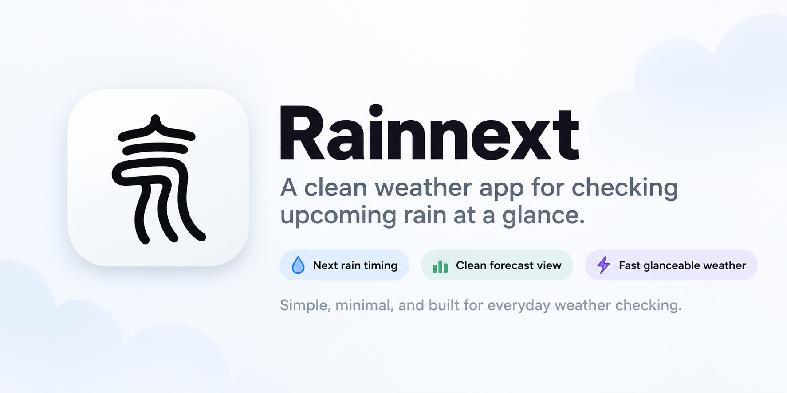

# RainNext

A lightweight native macOS menu bar app that answers one question:

> What will the rain situation be over the next couple of hours?

Not a weather app. The menu bar shows a glanceable state, the popover shows the
next two hours — or, on request, the next twelve or forty-eight — and that is
the whole product.

v0.1 — builds, runs, fetches live Buienradar data. Coverage is the Benelux.

## Menu bar notation

```
☂ 0.8       raining now at ~0.8 mm/h
☂ 27m       rain starts in 27 minutes
🌙 / ☁ / ❄   otherwise, the sky as the nearest station reports it
```

Rain comes first, because rain is what this app is for: the nowcast wins
whenever it has something to say, and the station observation fills the gap it
leaves. Drizzle too light to matter stays on the graph and out of the menu bar —
a countdown that expires with nothing falling outside is how people stop
trusting the number.

## What it does

- **Two hours of radar** in five-minute steps, as a timeline with a NOW marker
  and hover details. Twelve and forty-eight hours are available too, from a
  separate hourly feed — the header names which one is on screen, because "rain
  at 18:00" has not earned the trust "rain in 20 minutes" has.
- **Rain alerts**, off until switched on with the bell: one notification per
  shower, fired once rain is within 30 minutes, never while it is already
  raining. Focus and Do Not Disturb hold them back.
- **Locations**: current location (CoreLocation, reduced accuracy) plus a saved
  list searched with `CLGeocoder` — no API key. Seeded with five Dutch cities so
  the first launch is useful even if location permission is denied.
- **Refresh** on launch, every five minutes, and when the popover opens. A
  failed refresh keeps the last valid forecast on screen.

## Build

Xcode 27 is required for the SDK, but the project is a SwiftPM package — open
`Package.swift` in Xcode, or use the command line:

```sh
swift build          # needs DEVELOPER_DIR pointing at Xcode.app if
swift test           # xcode-select still points at CommandLineTools
./Scripts/bundle.sh  # → build/RainNext.app, installed in /Applications
```

`bundle.sh` wraps the binary in an `.app` and signs it with the first real
identity it finds, falling back to ad-hoc with a warning. **Notifications need a
real signature** — macOS refuses to treat an ad-hoc bundle with no Team
Identifier as a notification client, and no permission prompt ever appears. A
free Apple Development certificate is enough.

It then installs the bundle over `/Applications/RainNext.app`, quitting and
relaunching RainNext if it was running. Pass `--no-install` to stop at `build/`.

## Data

Precipitation nowcast from **[Buienradar.nl](https://www.buienradar.nl)**, via
the public `graphdata.buienradar.nl` feed — no token, no API key. Conditions and
temperature come from the 38 KNMI stations in `data.buienradar.nl/2.0/feed/json`.

Buienradar's terms for the free weather data require attribution with a
hyperlink, which the popover footer carries, and permit non-commercial use only.

## License

[GPL-3.0-or-later](LICENSE). Not distributed commercially.
